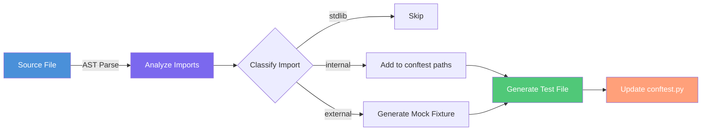

# TestSmith

> **A project-agnostic Python test scaffold generator**

TestSmith analyzes your Python source code via AST parsing and automatically generates pytest test scaffolds, mock fixtures, and test infrastructure—so you can focus on writing assertions, not boilerplate.

[](https://github.com/orieken/testsmith/actions)
[](https://opensource.org/licenses/MIT)

---

## How It Works

TestSmith follows a simple pipeline: **Analyze → Classify → Generate**



**What happens:**
1. **Analyze**: Parse source file with Python's AST to extract imports, classes, and functions
2. **Classify**: Categorize each import as stdlib (skip), internal (add path), or external (mock)
3. **Generate**: Create test file with proper structure, mock fixtures for external dependencies
4. **Update**: Modify `conftest.py` to ensure internal imports resolve correctly

---

## Features

### Core Functionality
- ✅ **Zero Configuration**: Works on any Python project structure
- ✅ **Smart Import Classification**: Automatically detects stdlib, internal, and external dependencies
- ✅ **Shared Mock Fixtures**: Generates reusable `*.fixture.py` files for external dependencies
- ✅ **Idempotent**: Safe to run multiple times—won't duplicate or break existing tests
- ✅ **Project-Aware**: Auto-detects project root and package structure

### Advanced Features
- 🤖 **LLM Test Body Generation**: Use `--generate-bodies` to fill in test assertions with AI
- 📊 **Dependency Graph Visualization**: Generate Mermaid diagrams with `--graph`
- 🧹 **Fixture Pruning**: Remove unused fixtures with `--prune`
- 📈 **Coverage Gap Analysis**: Identify untested code with `--coverage-gaps`
- 👀 **Watch Mode**: Auto-regenerate tests on file changes with `--watch`

### Distribution
- 📦 **Standalone Binaries**: No Python installation required
- 🐍 **PyPI Package**: Install with `pipx` or `pip`
- 🖥️ **Multi-Platform**: Linux, macOS (Intel + Apple Silicon), Windows

---

## Installation

### Option 1: Binary (No Python Required)

Download the latest binary for your platform from [GitHub Releases](https://github.com/orieken/testsmith/releases):

```bash
# Linux
curl -LO https://github.com/orieken/testsmith/releases/latest/download/testsmith-linux-amd64
chmod +x testsmith-linux-amd64
sudo mv testsmith-linux-amd64 /usr/local/bin/testsmith

# macOS (Intel)
curl -LO https://github.com/orieken/testsmith/releases/latest/download/testsmith-macos-amd64
chmod +x testsmith-macos-amd64
sudo mv testsmith-macos-amd64 /usr/local/bin/testsmith

# macOS (Apple Silicon)
curl -LO https://github.com/orieken/testsmith/releases/latest/download/testsmith-macos-arm64
chmod +x testsmith-macos-arm64
sudo mv testsmith-macos-arm64 /usr/local/bin/testsmith

# Windows (PowerShell)
Invoke-WebRequest -Uri https://github.com/orieken/testsmith/releases/latest/download/testsmith-windows-amd64.exe -OutFile testsmith.exe
```

### Option 2: pipx (Recommended for Python Users)

```bash
pipx install testsmith
```

### Option 3: pip

```bash
pip install testsmith
```

---

## Quick Start

### 1. Initialize TestSmith in Your Project

```bash
cd your-project/
testsmith --init
```

This creates:
- `tests/` directory
- `tests/fixtures/` for shared mocks
- `tests/fixtures/conftest.py` for fixture registration

### 2. Generate Tests for a File

```bash
testsmith src/services/payment.py
```

This creates:
- `tests/src/services/test_payment.py` with test scaffolds
- Mock fixtures in `tests/fixtures/` for external dependencies
- Updates `conftest.py` with necessary paths

### 3. Run Your Tests

```bash
pytest tests/
```

---

## Usage Examples

### Basic Test Generation

```bash
# Generate test for a single file
testsmith src/api/users.py

# Generate tests for all untested files
testsmith --all

# Generate tests for a directory
testsmith --path src/services/
```

### Advanced Features

```bash
# Generate test bodies with AI (requires ANTHROPIC_API_KEY)
testsmith src/api/users.py --generate-bodies

# Visualize dependency graph
testsmith --graph --graph-output deps.md

# Find and remove unused fixtures
testsmith --prune --confirm

# Analyze coverage gaps and prioritize testing
testsmith --coverage-gaps

# Watch mode: auto-regenerate on file changes
testsmith --watch
```

### Dry Run Mode

```bash
# Preview what would be generated without writing files
testsmith src/api/users.py --dry-run
```

---

## Configuration

TestSmith works with zero configuration, but you can customize behavior in `pyproject.toml`:

```toml
[tool.testsmith]
test_root = "tests/"
fixture_root = "tests/fixtures/"
exclude_dirs = ["venv", ".venv", "node_modules", "__pycache__"]
```

---

## Architecture

TestSmith is organized into distinct layers:

```
src/testsmith/
├── cli.py                  # CLI entry point
├── core/                   # Core analysis engine
│   ├── source_analyzer.py  # AST parsing & import extraction
│   ├── import_classifier.py # stdlib/internal/external classification
│   └── project_detector.py # Project structure detection
├── generation/             # Code generation
│   ├── test_generator.py   # Test file generation
│   ├── fixture_generator.py # Mock fixture generation
│   └── conftest_updater.py # conftest.py management
├── llm/                    # LLM integration
│   └── test_body_generator.py # AI-powered test bodies
├── visualization/          # Dependency graphs
│   ├── graph_builder.py    # Build dependency graphs
│   └── mermaid_renderer.py # Render Mermaid diagrams
├── maintenance/            # Maintenance tools
│   ├── fixture_pruner.py   # Remove unused fixtures
│   └── coverage_analyzer.py # Coverage gap analysis
└── support/                # Shared utilities
    ├── config.py           # Configuration management
    ├── models.py           # Data models
    └── templates.py        # Code templates
```

See [docs/architecture.md](docs/architecture.md) for detailed design documentation.

---

## Platform Support

- **Linux**: Ubuntu 20.04+, Debian 10+, RHEL 7+, Fedora 30+, CentOS 7+
- **macOS**: macOS 11+ (Big Sur and later), Intel and Apple Silicon
- **Windows**: Windows 10, Windows 11, Windows Server 2019+

---

## Development

### Local Setup

```bash
# Clone repository
git clone https://github.com/orieken/testsmith.git
cd testsmith

# Install dependencies
poetry install --with dev,build

# Run tests
poetry run pytest tests/ --cov=src/testsmith --cov-report=term-missing

# Lint
poetry run ruff check src/ tests/
poetry run black --check src/ tests/
```

### Build Binary Locally

```bash
# Linux/macOS
./scripts/build-local.sh

# Windows
.\scripts\build-local.ps1
```

---

## Contributing

Contributions are welcome! Please see [CONTRIBUTING.md](CONTRIBUTING.md) for guidelines.

---

## License

MIT License - see [LICENSE](LICENSE) for details.

Copyright (c) 2026 Oscar Rieken <oriekenjr@gmail.com>

Portfolio: https://rieken-portfolio.netlify.app/

---

## About

TestSmith was built as a learning project to explore static code analysis, test automation, and AI-assisted development. Read more about the story and philosophy behind the project in [ABOUT.md](ABOUT.md).

---

## Acknowledgments

Built with:
- [Python AST](https://docs.python.org/3/library/ast.html) for source analysis
- [pytest](https://pytest.org/) for testing framework
- [Anthropic Claude](https://www.anthropic.com/) for LLM test generation
- [PyInstaller](https://pyinstaller.org/) for binary builds
- [GitHub Actions](https://github.com/features/actions) for CI/CD
