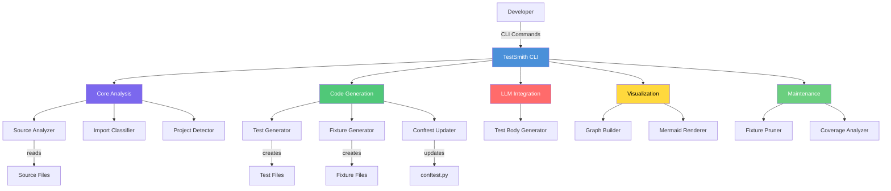
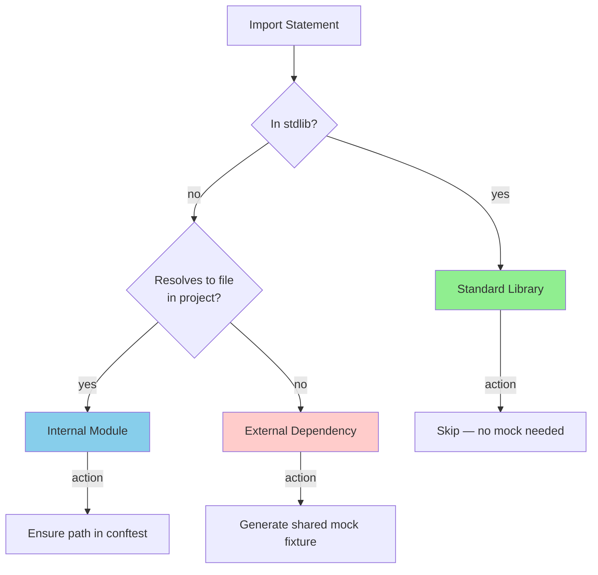
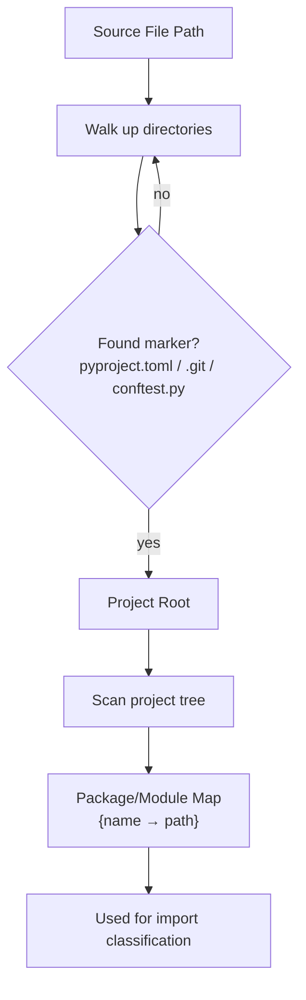
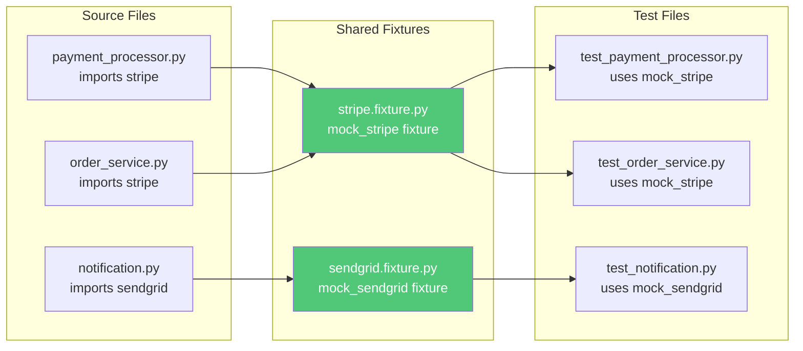
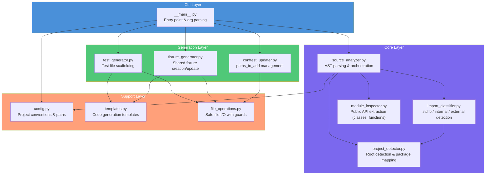
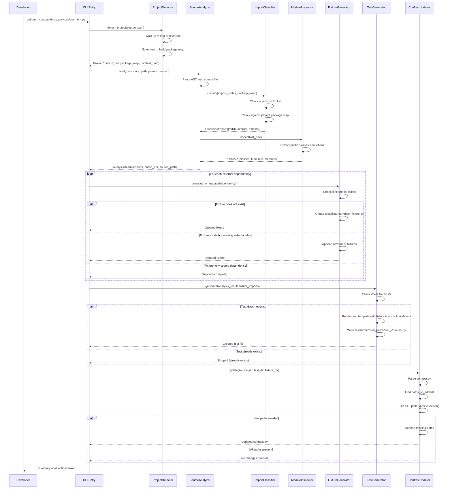
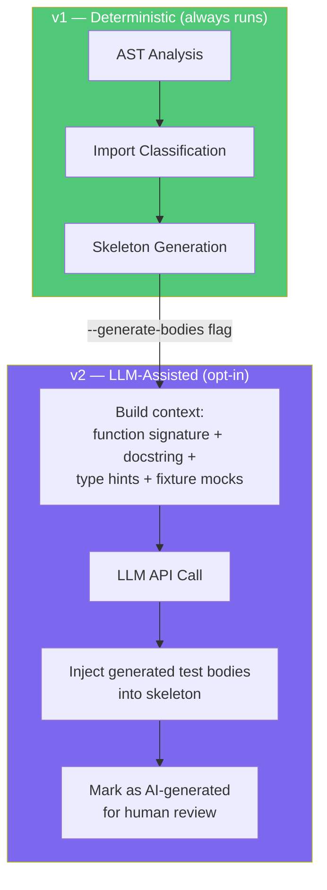

# TestSmith — Architectural Overview

## Table of Contents

1. [System Context](#system-context)
2. [Core Concepts](#core-concepts)
3. [Component Architecture](#component-architecture)
4. [Data Flow](#data-flow)
5. [Module Design](#module-design)
6. [Shared Fixture Strategy](#shared-fixture-strategy)
7. [File Generation Strategy](#file-generation-strategy)
8. [Configuration & Conventions](#configuration--conventions)
9. [Error Handling Philosophy](#error-handling-philosophy)
10. [Testing Strategy (Yes, We Test the Test Tool)](#testing-strategy)
11. [ML Integration Roadmap](#ml-integration-roadmap)
12. [Future Considerations](#future-considerations)

---

## System Context

TestSmith is a project-agnostic, developer-facing CLI tool that sits between your source code and your test infrastructure. It reads source files, analyzes their dependency graphs via Python's AST module, and generates the scaffolding needed to test them with pytest and pytest-mock.

It works on any Python project regardless of directory structure, framework, or domain.



### Boundaries

- **In scope:** 
  - AST-based import analysis
  - Test/fixture file generation
  - conftest.py path management
  - Project structure detection
  - LLM-powered test body generation
  - Dependency graph visualization
  - Fixture lifecycle management
  - Coverage gap analysis
  - Watch mode for live development
  
- **Out of scope:** 
  - Running tests
  - Measuring code coverage
  - Modifying source code
  - Managing pip dependencies

---

## Core Concepts

### Import Classification

Every import in a Python file falls into one of three categories. TestSmith's primary job is classifying imports correctly and acting on each category appropriately.

The classification is **project-structure-aware**: anything that resolves to a file or directory within the project is internal. No hardcoded lists, no configuration needed.



| Category | Detection Method | Action |
|----------|-----------------|--------|
| **stdlib** | `sys.stdlib_module_names` (3.10+) or vendored list | Ignore — always available |
| **internal** | Root package resolves to a directory/file in the project tree | Ensure parent directory is in `paths_to_add` |
| **external** | Not stdlib AND not resolvable in project tree | Generate/update shared mock fixture |

### Project Structure Detection

TestSmith auto-detects the project root by walking up from the source file looking for markers: `pyproject.toml`, `setup.py`, `setup.cfg`, `.git`, or `conftest.py`. From the project root, it builds a map of all Python packages and modules in the tree. This map is what powers internal vs. external classification — no configuration required.



### The Idempotency Contract

Every operation TestSmith performs is idempotent:

- **Fixture files:** If `tests/fixtures/<dep>.fixture.py` exists, new mock fixtures for additional sub-modules are **appended** (existing fixtures are never modified or removed).
- **Test files:** If `tests/<mirrored_path>/test_<n>.py` exists, it is **never overwritten**. TestSmith skips it and logs a message.
- **conftest.py paths:** Only appended if the path string is not already present in the `paths_to_add` list.
- **`__init__.py` files:** Only created if they don't already exist.

This means you can safely re-run TestSmith on the same file or across your entire project without destroying hand-written tests or fixtures.

### Shared Fixture Model

Fixtures are organized **by external dependency**, not by source module. If `payment_processor.py` and `order_service.py` both import from `stripe`, they share `tests/fixtures/stripe.fixture.py`.



---

## Component Architecture



### Layer Responsibilities

| Layer | Responsibility | Dependency Rule |
|-------|---------------|-----------------|
| **CLI** | Argument parsing, orchestration, user feedback | Depends on Core + Generation |
| **Core** | Analysis logic — pure functions, no side effects | Depends only on Support |
| **Generation** | File creation — all I/O lives here | Depends on Support |
| **Support** | Shared utilities, configuration, templates | Depends on nothing (leaf layer) |

---

## Data Flow

The complete lifecycle of a TestSmith invocation:



### Data Models

```python
@dataclass
class ProjectContext:
    """Detected project structure information."""
    root: Path                    # Project root directory
    package_map: dict[str, Path]  # {package_name: absolute_path}
    conftest_path: Path | None    # Path to root conftest.py
    existing_paths: list[str]     # Current paths_to_add entries

@dataclass
class ImportInfo:
    """A single import statement parsed from source."""
    module: str          # e.g., "stripe.checkout"
    names: list[str]     # e.g., ["Session", "LineItem"]
    is_from: bool        # True for "from x import y" style
    alias: str | None    # e.g., "s" in "import stripe as s"
    line_number: int     # For error reporting

@dataclass
class ClassifiedImports:
    """Imports sorted by category."""
    stdlib: list[ImportInfo]
    internal: list[ImportInfo]
    external: list[ImportInfo]

@dataclass
class PublicMember:
    """A public class or function from the source module."""
    name: str
    kind: str             # "class" or "function"
    parameters: list[str] # Parameter names (for functions/methods)
    methods: list[str]    # Public method names (for classes)
    docstring: str | None

@dataclass
class AnalysisResult:
    """Complete analysis output for a source file."""
    source_path: Path
    module_name: str
    imports: ClassifiedImports
    public_api: list[PublicMember]
    project: ProjectContext
```

---

## Module Design

### `project_detector.py`

Discovers the project root and builds a map of all internal packages.

**Detection algorithm:**
1. Starting from the source file's directory, walk up until finding a marker file (`pyproject.toml`, `setup.py`, `setup.cfg`, `.git`, `conftest.py`).
2. From the detected root, recursively scan for Python packages (directories with `__init__.py`) and standalone `.py` files.
3. Build a `package_map: dict[str, Path]` mapping root package names to their absolute paths.

**Why this matters for genericity:** This is the key to being project-agnostic. Instead of relying on hardcoded paths or configuration, TestSmith understands any project's layout by scanning it.

### `source_analyzer.py`

The heart of TestSmith. Uses Python's `ast` module to parse source files without executing them.

**Key responsibilities:**
- Parse the source file into an AST
- Walk the tree to extract all `Import` and `ImportFrom` nodes
- Delegate classification to `ImportClassifier`
- Delegate public API extraction to `ModuleInspector`
- Return a complete `AnalysisResult`

**Design decisions:**
- We parse AST, never `exec` or `import` the source file. This avoids triggering side effects and means TestSmith works even when dependencies aren't installed.
- Both `import x` and `from x import y` patterns are handled, including relative imports.
- Conditional imports (inside `if`/`try` blocks) are still captured — they're dependencies regardless of the condition.

### `import_classifier.py`

Determines the category of each import using the project's package map.

**Classification algorithm:**
1. Check against Python's `sys.stdlib_module_names` (3.10+) or a vendored stdlib list for older versions.
2. Extract the root package name from the import (e.g., `stripe` from `stripe.checkout.Session`).
3. Check if that root package exists in the `package_map` built by `ProjectDetector`.
4. If yes → internal. If no → external.

**Edge cases handled:**
- Relative imports (`.foo`, `..bar`) → always internal
- Namespace packages (no `__init__.py`) → check directory existence
- Conditional imports in `try/except` blocks → still classified
- Star imports (`from x import *`) → classified by module, names left as `["*"]`

### `module_inspector.py`

Extracts the public API from the source AST.

**Rules for "public":**
- Functions and classes whose names don't start with `_`
- Public methods within public classes (for generating method-level test stubs)
- Module-level constants are noted but don't generate test stubs
- Extracts parameter names from function/method signatures (for skeleton generation)

### `fixture_generator.py`

Creates or updates `tests/fixtures/<dependency_name>.fixture.py`.

**Shared fixture strategy:**

Fixtures are keyed by the **root package name** of the external dependency. When TestSmith encounters `from stripe.checkout import Session`, it:

1. Checks if `tests/fixtures/stripe.fixture.py` exists
2. If not, creates it with a `mock_stripe` fixture
3. If it exists, parses it to see if `stripe.checkout` is already mocked
4. If the sub-module is missing, appends the new mock to the existing fixture file

**Generated fixture structure:**
```python
"""Shared mock fixtures for the stripe external dependency."""
import pytest


@pytest.fixture
def mock_stripe(mocker):
    """Mock for stripe and its sub-modules."""
    mock = mocker.Mock()
    mock.checkout.Session = mocker.Mock()
    mocker.patch.dict("sys.modules", {
        "stripe": mock,
        "stripe.checkout": mock.checkout,
    })
    return mock
```

**Append behavior:** When a new source file also imports `stripe.billing`, the fixture file is updated:
```python
    mock.checkout.Session = mocker.Mock()
    mock.billing = mocker.Mock()          # ← appended
    mocker.patch.dict("sys.modules", {
        "stripe": mock,
        "stripe.checkout": mock.checkout,
        "stripe.billing": mock.billing,   # ← appended
    })
```

### `test_generator.py`

Creates `tests/<mirrored_path>/test_<module_name>.py`.

**Generated test structure:**
```python
"""Tests for payment_processor module."""
import pytest


class TestPaymentProcessor:
    """Tests for PaymentProcessor."""

    def test_init(self, mock_stripe):
        """Test PaymentProcessor initialization."""
        # TODO: Implement test
        pass

    def test_charge(self, mock_stripe):
        """Test PaymentProcessor.charge."""
        # TODO: Implement test
        pass

    def test_refund(self, mock_stripe):
        """Test PaymentProcessor.refund."""
        # TODO: Implement test
        pass


class TestCalculateTotal:
    """Tests for calculate_total."""

    def test_calculate_total(self):
        """Test calculate_total."""
        # TODO: Implement test
        pass
```

Note: functions that don't depend on external imports get test methods without fixture parameters. Only methods that need mocked dependencies include the relevant fixture in their signature.

### `conftest_updater.py`

Reads and modifies `conftest.py` to register all three path categories.

**Paths registered:**
1. **Source directory** — so test files can import the module under test
2. **Test directory** — so pytest discovers the mirrored test structure
3. **Fixtures directory** — so shared fixture files are importable

**Strategy:**
- Parse `conftest.py` as text, find the `paths_to_add` list
- Compare required paths against existing entries (string comparison)
- Append any missing paths with a comment indicating which source file triggered the addition
- Preserve all existing comments, formatting, and structure
- If `conftest.py` doesn't exist, create it with the standard `pytest_configure` pattern
- If `paths_to_add` is not found in an existing conftest, create the variable and the `pytest_configure` function

---

## Shared Fixture Strategy

This section details how shared fixtures are managed across multiple source files and test files.

### Naming Convention

| External Dependency | Fixture File | Fixture Name |
|---------------------|-------------|-------------|
| `stripe` | `tests/fixtures/stripe.fixture.py` | `mock_stripe` |
| `game_rules` | `tests/fixtures/game_rules.fixture.py` | `mock_game_rules` |
| `sendgrid` | `tests/fixtures/sendgrid.fixture.py` | `mock_sendgrid` |
| `some_lib.deep.module` | `tests/fixtures/some_lib.fixture.py` | `mock_some_lib` |

The fixture file is always named after the **root package**. All sub-modules of that package are mocked within the same fixture.

### Fixture Discovery by Test Files

Test files import fixtures from the shared location. The conftest `paths_to_add` ensures `tests/fixtures/` is on the Python path, so fixtures are discoverable by pytest's standard fixture resolution.

```python
# In tests/fixtures/conftest.py (auto-generated)
from tests.fixtures.stripe_fixture import mock_stripe  # noqa: F401
from tests.fixtures.game_rules_fixture import mock_game_rules  # noqa: F401
```

Alternatively, using `conftest.py` at the fixtures level to re-export all fixtures, so test files just declare fixture parameters without explicit imports.

### Collision Handling

If two source files are processed and both need `stripe` mocked, but with different sub-modules:

```
# First run (payment_processor.py): stripe.checkout
# Second run (subscription.py): stripe.billing
```

After both runs, `stripe.fixture.py` contains mocks for both `stripe.checkout` and `stripe.billing`. The fixture is the **union** of all observed sub-modules.

---

## File Generation Strategy

### Output Mapping

Given input `src/services/payment_processor.py` with imports from `stripe` and `sendgrid`:

| Generated/Updated File | Path |
|------------------------|------|
| **Test file** | `tests/src/services/test_payment_processor.py` |
| **Fixture (stripe)** | `tests/fixtures/stripe.fixture.py` |
| **Fixture (sendgrid)** | `tests/fixtures/sendgrid.fixture.py` |
| **Fixture conftest** | `tests/fixtures/conftest.py` (re-exports fixtures) |
| **Root conftest.py** | Updated with paths for `src/services/`, `tests/src/services/`, `tests/fixtures/` |
| **`__init__.py` files** | Created in each intermediate test directory |

### Directory Creation

TestSmith creates any missing intermediate directories and `__init__.py` files:

```
tests/
├── __init__.py
├── fixtures/
│   ├── __init__.py
│   ├── conftest.py              ← re-exports shared fixtures
│   ├── stripe.fixture.py        ← shared across test files
│   └── sendgrid.fixture.py
└── src/
    ├── __init__.py
    └── services/
        ├── __init__.py
        └── test_payment_processor.py
```

---

## Configuration & Conventions

### Auto-Detection (Zero Config)

TestSmith works out of the box with zero configuration by detecting:

- **Project root** from marker files
- **Internal packages** from project structure scan
- **Existing conftest.py** and its `paths_to_add`
- **Existing fixtures** to avoid duplication

### Optional Configuration (`pyproject.toml`)

For projects with non-standard conventions, TestSmith reads from `[tool.testsmith]`:

```toml
[tool.testsmith]
test_root = "tests/"
fixture_dir = "tests/fixtures/"
fixture_suffix = ".fixture.py"
conftest_path = "conftest.py"
paths_to_add_var = "paths_to_add"

# Directories to exclude from project scanning
exclude_dirs = ["node_modules", ".venv", "build", "dist"]

# Additional directories to always treat as internal
extra_internal_paths = []
```

All settings have sensible defaults. Configuration is never required.

### CLI Interface

```
usage: python -m testsmith [-h] [--dry-run] [--verbose] [--config CONFIG]
                           [--init] source_file

positional arguments:
  source_file       Path to the Python source file to analyze

optional arguments:
  -h, --help        Show this help message
  --dry-run         Show what would be generated without writing files
  --verbose         Print detailed analysis and classification info
  --config CONFIG   Path to config file (default: pyproject.toml)
  --init            Initialize conftest.py and fixtures directory structure
```

---

## Error Handling Philosophy

TestSmith follows a **fail-safe, warn-loudly** approach:

| Scenario | Behavior |
|----------|----------|
| Source file doesn't exist | Exit with clear error message |
| Source file has syntax errors | Exit with error + point to the line |
| Fixture file already exists (complete) | Skip, log info message |
| Fixture file exists (needs update) | Append new mocks, log what was added |
| Test file already exists | Skip, log info message |
| `conftest.py` not found | Create one with standard structure |
| `paths_to_add` not found in conftest | Create the variable and `pytest_configure` |
| Cannot classify an import | Default to "external" (safer to over-mock) |
| Permission error writing files | Exit with error + suggest fix |
| Project root not detectable | Exit with error, suggest `--config` flag |

No operation should ever silently overwrite existing hand-written code.

---

## Testing Strategy

TestSmith itself targets **85% code coverage** with the following test structure:

```
testsmith/
└── tests/
    ├── unit/
    │   ├── test_source_analyzer.py       # AST parsing logic
    │   ├── test_import_classifier.py     # Classification rules
    │   ├── test_module_inspector.py      # Public API extraction
    │   ├── test_project_detector.py      # Root detection & scanning
    │   ├── test_fixture_generator.py     # Fixture creation & update
    │   ├── test_test_generator.py        # Test file output
    │   └── test_conftest_updater.py      # Conftest modification
    ├── integration/
    │   ├── test_cli.py                   # End-to-end CLI invocation
    │   ├── test_full_generation.py       # Full pipeline with real files
    │   └── test_shared_fixtures.py       # Multi-file fixture sharing
    └── fixtures/
        ├── sample_sources/               # Example .py files to analyze
        │   ├── simple_module.py
        │   ├── complex_imports.py
        │   ├── class_heavy_module.py
        │   ├── relative_imports.py
        │   └── shared_dependency.py      # For testing fixture sharing
        └── expected_outputs/             # Golden files for comparison
            ├── test_simple_module.py
            ├── simple_module.fixture.py
            └── updated_fixture.py        # For testing append behavior
```

### Key Testing Principles

- **Unit tests** use no I/O — analyzers work on AST trees built in-memory, generators return strings
- **Integration tests** use `tmp_path` fixtures to create real file structures and verify end-to-end behavior
- **Golden file tests** compare generated output against expected files for regression detection
- **Parametrized tests** cover import classification edge cases (relative imports, namespace packages, conditional imports, star imports)
- **Fixture append tests** verify that running TestSmith twice with different source files correctly merges shared fixtures

---

## ML Integration Roadmap

### v1: Pure AST (No ML)

v1 is entirely deterministic. AST parsing, rule-based classification, template-based generation. No network calls, no API keys, no non-determinism. This is the reliable foundation.

### v2: LLM-Assisted Test Body Generation

The natural extension is using an LLM to generate meaningful test bodies instead of `# TODO` stubs. Here's where it adds value and where the boundaries are:



**What the LLM receives:**
- Function/method signature with type hints
- Docstring (if present)
- Available fixture names and what they mock
- The class context (if the function is a method)

**What the LLM generates:**
- 2–3 test cases per function: happy path, edge case, error condition
- Assertions that use the actual fixture mocks
- Each test body is wrapped in a `# --- AI-GENERATED: review before committing ---` comment

**What the LLM does NOT do:**
- Classify imports (too important to be non-deterministic)
- Decide file structure or paths (deterministic rules only)
- Overwrite existing tests (idempotency contract still holds)

**Trigger:** `python -m testsmith --generate-bodies src/services/payment.py`

Without the flag, v2 behaves identically to v1. The LLM integration is strictly additive and opt-in.

---

## Future Considerations

These are explicitly **out of scope** for v1 but worth noting for the roadmap:

| Feature | Version | Rationale |
|---------|---------|-----------|
| **Batch mode** | v1.1 | `testsmith --all` to scaffold tests for every untested source file |
| **Watch mode** | v1.2 | Re-generate when source files change |
| **LLM test body generation** | v2.0 | Opt-in AI-assisted assertion generation |
| **Custom templates** | v2.0 | Jinja2 templates for teams with specific conventions |
| **Import graph visualization** | v2.1 | Mermaid diagram of project dependency graph |
| **Pre-commit hook** | v2.1 | Ensure every new source file has a corresponding test scaffold |
| **Fixture pruning** | v2.2 | Detect and remove unused mock fixtures |
| **Coverage gap analysis** | v3.0 | Identify untested code paths and suggest targeted tests |
