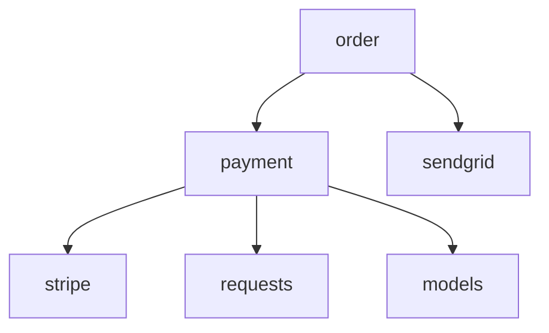

# Feature: graph — Dependency Graph Visualisation

## What It Does

`testsmith graph` analyses every source file in the project, builds a directed dependency graph, computes per-module coupling metrics, and renders the result as a Mermaid diagram embedded in a Markdown file.

The graph shows:
- **Nodes**: every source module in the project
- **Internal edges**: imports between modules within the project
- **External edges**: imports of third-party packages
- **Metrics table**: fan-in, fan-out, and coupling score for each module

This helps identify over-coupled modules that are good candidates for test coverage priority (see `gaps`) and refactoring.

---

## CLI

```
testsmith graph [flags]

Flags:
  --output <file>     Output Markdown file (default: testsmith_graph.md)
  --workspace <name>  Graph only this workspace (name or path)
  --dry-run           Print report to stdout instead of writing a file
  --verbose, -v       Print per-workspace node/edge counts
```

### Workspace Mode

When `workspaces:` are configured each workspace produces a labelled `## Workspace: <name>` section in the same report file. Use `--workspace <name>` to limit to one workspace.

---

## Example Output (`testsmith_graph.md`)

```markdown
# TestSmith Dependency Graph

| Module | Internal Deps | External Deps | Dependents | Coupling Score |
|--------|-------------|--------------|------------|---------------|
| services.payment | 2 | 3 | 4 | 0.78 |
| core.classifier  | 0 | 0 | 6 | 0.10 |


```

---

## Go Implementation

### Key Types

```go
// internal/domain/types.go
type DependencyGraph struct {
    Nodes []GraphNode
    Edges []GraphEdge
}

type ModuleMetrics struct {
    Name                 string
    InternalDependencies int
    ExternalDependencies int
    Dependents           int
    CouplingScore        float64
}
```

### Pipeline

```go
// internal/analysis/graph.go
func BuildDependencyGraph(analyses []*domain.SourceAnalysis) *domain.DependencyGraph
func ComputeMetrics(g *domain.DependencyGraph) []domain.ModuleMetrics
func RenderMermaid(g *domain.DependencyGraph) string
func RenderMetricsTable(metrics []domain.ModuleMetrics) string
```

The graph pipeline reuses `Pipeline.DiscoverAndAnalyzeAll()` — no extra parsing needed.

### Coupling Score Formula

```
coupling_score = (fan_out_external * 0.6 + fan_in * 0.4) / max_possible
```

A score approaching 1.0 indicates high coupling.

### Files Involved

| File | Role |
|------|------|
| `cmd/testsmith/graph.go` | Cobra subcommand, workspace routing, dry-run |
| `internal/analysis/graph.go` | Graph construction, metrics, Mermaid + table rendering |
| `internal/analysis/pipeline.go` | `DiscoverAndAnalyzeAll` |
